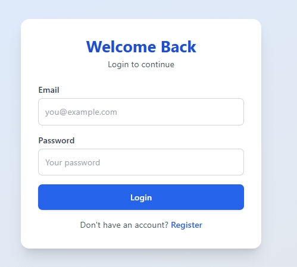
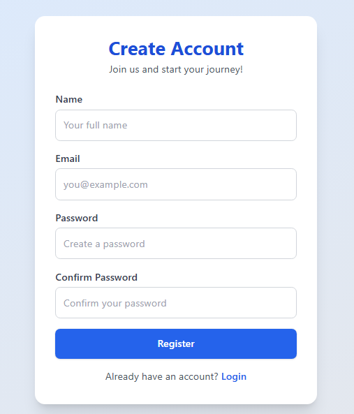
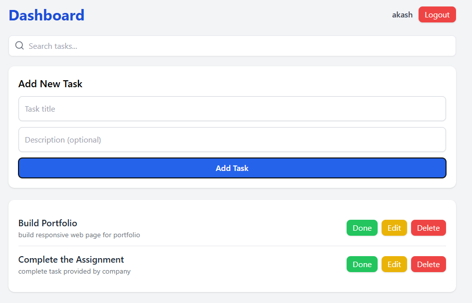

# 🚀 **Minitasks – Full Stack Todo Application (Assignment Submission)**

This project is built as part of the **Frontend Developer Assignment**.
It demonstrates a complete **full-stack application** with authentication, protected routes, and task management (CRUD + search).

### **Tech Used**

* **Frontend:** React (Vite), React Router, TailwindCSS, Axios
* **Backend:** Node.js, Express.js, MongoDB (Mongoose), JWT, bcrypt
* **Validation:** express-validator
* **Auth:** JWT-based, protected routes
* **Other:** Vite, Nodemon

---

# 📌 **Features Overview**

### 🔑 **Authentication**

* User Registration
* User Login
* JWT stored securely
* Auth-protected Dashboard
* Profile fetching

### 📝 **Task Management**

* Create new tasks
* Read/Display task list
* Update title/description
* Toggle completed/undo
* Delete tasks
* Search tasks by title
* Validation on both **client & server**

### 🎨 **Frontend UI**

* Responsive design
* Clean dashboard
* Modals for edit
* Input validation errors
* Loading states
* ProtectedRoute component

### 🛡 **Security**

* Password hashing using bcrypt
* JWT authentication
* express-validator input sanitization
* CORS enabled
* Errors masked for safety

---

# 📁 **Project Structure**

```
TodolistAssignment/
│
├── backend/
│   ├── models/
│   ├── routes/
│   ├── middleware/
│   ├── server.js
│   ├── package.json
│   └── .env.example
│
├── frontend/
│   ├── src/
│   │   ├── pages/
│   │   ├── components/
│   │   ├── services/
│   │   └── main.jsx
│   ├── index.html
│   └── package.json
│
└── README.md   ← (You are here)
```

---

# ⚙️ **Environment Variables**

## **Backend (.env)**

`.env`

```
PORT=5000
MONGO_URI=mongodb://127.0.0.1:27017/minitasks
JWT_SECRET=your_jwt_secret
```

## **Frontend (.env)**

Create `frontend/.env`:

```
VITE_API_URL=http://localhost:5000/api
```

---

# 🚀 **Setup & Installation**

### 1️⃣ Clone the repo

```
git clone https://github.com/akashmhadgut/TodolistAssignment.git
cd TodolistAssignmentAssignment
```

---

# 🖥 Backend Setup

```
cd backend
npm install
cp .env.example .env
npm run dev   # or npm start
```

Backend should start on:

```
http://localhost:5000
```

---

# 🌐 Frontend Setup

Open a **new terminal**:

```
cd frontend
npm install
npm run dev
```

Frontend will run on:

```
http://localhost:5173/
```

---

# 🧪 **API Endpoints (Summary)**

### **AUTH**

| Method | Endpoint           | Description        |
| ------ | ------------------ | ------------------ |
| POST   | /api/auth/register | Register new user  |
| POST   | /api/auth/login    | Login user         |
| GET    | /api/auth/profile  | Get logged-in user |
| PUT    | /api/auth/profile  | Update profile     |

### **TASKS**

| Method | Endpoint       | Description                  |
| ------ | -------------- | ---------------------------- |
| GET    | /api/tasks?q=  | List tasks (optional search) |
| POST   | /api/tasks     | Create task                  |
| PUT    | /api/tasks/:id | Update task                  |
| DELETE | /api/tasks/:id | Delete task                  |

---
 

# 📈 **Scalability & Production Notes**

### **Frontend**

* Deploy on Vercel/Netlify/S3 + CloudFront
* Use environment variables for API URLs
* Add error boundaries + prefetching

### **Backend**

* Use PM2 or Docker container
* Deploy behind Nginx load balancer
* Add rate limiting & helmet middleware
* Convert JWT to Access + Refresh token pair

### **Database (MongoDB)**

* Use Atlas with auto-scaling
* Add indexes for user + title search
* Enable backups & monitoring

### **Logging & Monitoring**

* Use Winston/Morgan logs
* Add metrics (Prometheus/OpenTelemetry)

---
# 🖼 Screenshots

Below are screenshots of the core pages of the application:

### 🔐 Login Page


### 📝 Register Page


### 📋 Dashboard Page


# 📤 **Submission Notes**

* Frontend and backend run independently
* Includes full JWT auth flow
* Includes CRUD + search
* Includes client + server validation
* Includes protected routes
* Includes Postman collection
* Includes production scaling notes

---

# 🎉 **Final Note**

This project showcases complete frontend + backend skills, clean architecture, and production-ready coding practices suitable for a real-world scalable app.

---
 